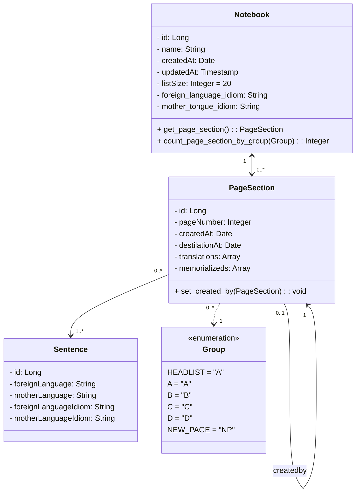

```mermaid
    classDiagram
        class Notebook {
            - id: Long
            - name: String
            - createdAt: Date
            - updatedAt: Timestamp
            - listSize: Integer = 20
            - foreign_language_idiom: String
            - mother_tongue_idiom: String

            + get_page_section(): PageSection
            + count_page_section_by_group(Group): Integer 
        }        

        class PageSection {
            - id: Long
            - pageNumber: Integer
            - createdAt: Date
            - destilationAt: Date
            - translations: Array<String>
            - memorializeds: Array<Boolean>

            + set_created_by(PageSection): void
        }

        class Sentence {
            - id: Long
            - foreignLanguage: String
            - motherLanguage: String
            - foreignLanguageIdiom: String      
            - motherLanguageIdiom: String   
        }

        class Group {
            <<enumeration>>
            HEADLIST = "A"
            A        = "A"
            B        = "B"
            C        = "C"
            D        = "D"
            NEW_PAGE = "NP"
        }
    
        Notebook "1"        <-->    "0..*" PageSection
        PageSection "0..1"   -->    "1" PageSection: createdby
        PageSection "0..*"   -->    "1..*" Sentence
        PageSection "0..*"   ..>    "1" Group
```
